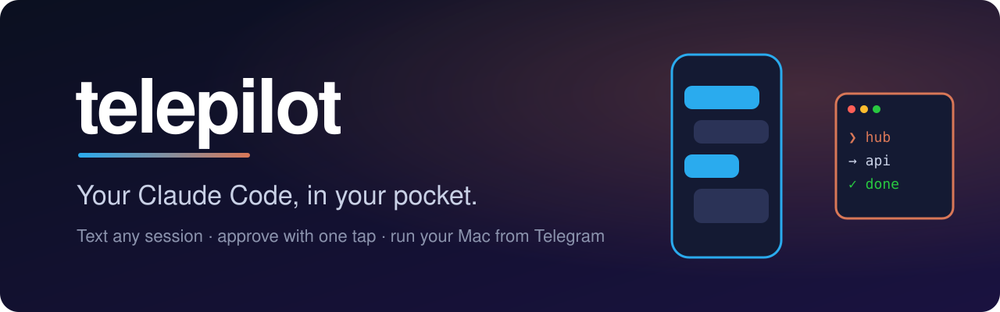
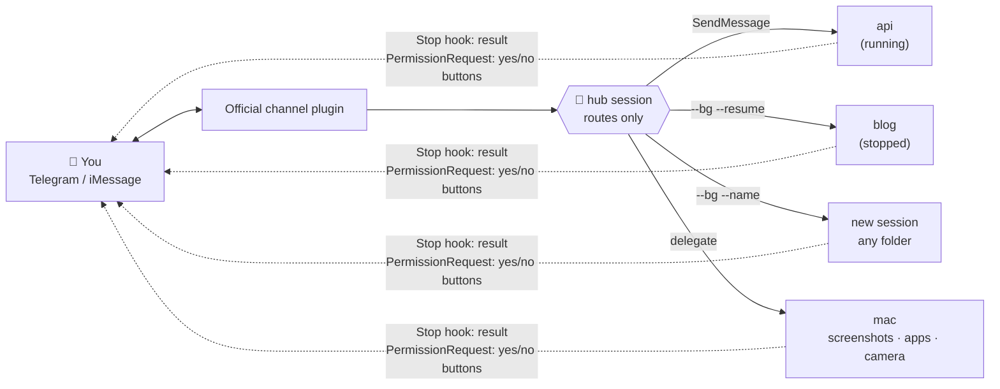

<div align="center">



<h3>Text your Claude Code from anywhere. It does the work on your Mac and texts you back.</h3>

<p>
  <a href="#-quick-start"></a>
  <a href="#-how-it-works"></a>
  
  
  <a href="LICENSE"></a>
</p>

<p>
  <a href="#-quick-start"><b>Quick start</b></a> ·
  <a href="#-features"><b>Features</b></a> ·
  <a href="#-how-it-works"><b>How it works</b></a> ·
  <a href="#-commands"><b>Commands</b></a> ·
  <a href="#-security"><b>Security</b></a>
</p>

</div>

---

You left a Claude Code session running a refactor. You're on the train. Did the tests pass? Is it stuck on a permission prompt?

**telepilot turns Telegram (or iMessage) into a remote control for every Claude Code session on your Mac.** Message any session by name, start new ones in any repo, approve risky actions with a tap, and grab a screenshot or camera photo. You can even unlock the Mac.

It's not a new agent. **It's _your_ Claude Code**, with your plan, sessions, skills, MCP servers and permissions. The chat app is just the pipe.

<div align="center">

<!-- Replace with a real recording: assets/demo.gif (phone screen recording, ~15s) -->
<!--  -->

</div>

```text
you   @api run the tests and fix anything that fails
hub   → api
api   [api] 3 tests were failing on the date parser. Fixed in src/date.ts, all 128 pass ✅

you   /new blog ~/code/blog fix the typo in the README
hub   🆕 blog started in ~/code/blog (★ active)
blog  🔐 [blog] wants to run: git push          [ ✅ yes ]  [ ❌ no ]
you   *taps yes*
blog  [blog] Fixed "recieve" → "receive" and pushed to main.
```

## ⚡ Quick start

In Claude Code, run three commands:

```bash
/plugin marketplace add saswatsam786/telepilot
/plugin install telepilot@telepilot
/telepilot:setup
```

Setup asks one question (Telegram or iMessage) and does the rest: it installs Bun and tmux if needed, connects your bot, pairs your account and starts the hub. It takes about 2 minutes.

> [!TIP]
> Run `telepilot service install` to keep it always on. It starts at login and restarts itself if anything dies.

## ✨ Features

<table>
<tr>
<td width="50%" valign="top">

### 🧭 Talk to any session
`@api fix the build` goes to a running session. If that session is stopped, it's resumed. `/new` starts a session in any folder. When you don't name one, the hub picks the right session.

</td>
<td width="50%" valign="top">

### ✅ One-tap approvals
Permission prompts arrive as **yes / no buttons** on your phone. Claude Code's permission system stays fully on.

</td>
</tr>
<tr>
<td valign="top">

### 💻 Your Mac, remotely
You can take screenshots and camera photos, open apps, run Shortcuts, read the clipboard, set the volume, check the battery, and use `/unlock` and `/lock`.

</td>
<td valign="top">

### 📬 Results come to you
Each session posts its own answer when it finishes, with a typing indicator while it works and a "still working" ping on long jobs.

</td>
</tr>
<tr>
<td valign="top">

### 🎙 Voice notes
Voice notes are transcribed locally with whisper.cpp, then routed like typed text. No cloud speech API.

</td>
<td valign="top">

### 🛡 Safe by default
You get a pairing allowlist, guard hooks, single-use approval codes, `/panic` to stop everything, and `/audit` to see every remote action.

</td>
</tr>
</table>

## 🧠 How it works



- **The hub only routes.** It runs Anthropic's official, allowlisted Telegram channel together with telepilot's dispatcher. It never does heavy work, so it always answers quickly.
- **Workers are ordinary Claude Code sessions.** Their hooks post results and approval buttons straight to your chat. No hub tokens are spent relaying.
- **No server, no cloud.** Everything runs on your Mac with first-party Claude Code features: background sessions, cross-session messaging and hooks.

<details>
<summary><b>Why not just use the Telegram plugin on its own?</b></summary>

<br>

The official channel connects Telegram to **one** session. telepilot adds:

- routing to many named sessions, including new and stopped ones
- approvals relayed from background sessions
- Mac tools, unlock and lock
- an always-on supervisor
- guard rails for phone-driven turns

</details>

## 📟 Commands

| Send | What happens |
|---|---|
| `@name <task>` · `name: <task>` | Send to that session |
| `<anything>` | Send to the active session ★, or let the hub decide |
| `/new <name> [folder] [task]` | Start a background session |
| `/sessions` | List sessions, with tap-to-switch buttons |
| `/switch` · `/logs` · `/stop <name>` | Manage sessions |
| `/screenshot` · `/photo` | Screenshot or camera photo of the Mac |
| `/unlock` · `/lock` | Unlock (after you tap yes) or lock the Mac |
| `/panic` | Stop every session telepilot started and deny pending requests |
| `/audit` | Recent remote actions |
| 🎙 voice note | Transcribed locally, then routed |

<details>
<summary><b>🖥 Launcher commands (on the Mac)</b></summary>

<br>

```bash
telepilot start | stop | restart | status | logs | attach | doctor
telepilot stop --all        # kill switch: hub + every session telepilot started
telepilot permissions       # trigger the macOS permission pop-ups once
telepilot unlock-setup      # store your login password in the Keychain for /unlock
telepilot allow-tools       # let sessions use telepilot's Mac tools without prompts
telepilot service install   # LaunchAgent: start at login, self-heal
```

</details>

<details>
<summary><b>📋 Requirements</b></summary>

<br>

- macOS with the Claude Code CLI 2.1.288 or newer, logged in with claude.ai (Pro/Max) or an API key. On Team and Enterprise plans, an admin must enable Channels.
- [Bun](https://bun.sh) and tmux. Setup installs them if they're missing.
- Optional, for voice notes: `brew install ffmpeg whisper-cpp` plus a whisper model.

</details>

## 🔐 Security

> [!IMPORTANT]
> Whoever controls your Telegram account can drive your Mac. **Turn on Telegram two-step verification.**

- **Only you get in.** The official pairing allowlist means only your account reaches the hub.
- **Permissions stay on.** Risky actions need your tap. Approval codes are random, single-use and expiring, and 3 wrong codes lock approvals for 10 minutes.
- **Guard hooks** block `sudo`, deleting `/` or `~`, disk erasing, `curl | sh`, and reading SSH, AWS or Keychain secrets or the bot token. They also block edits to Claude settings and launch agents.
- **Trusted routing only.** Workers trust routing headers only from the real hub process, checked by name and PID.
- **Your password stays on the Mac.** `/unlock` reads it from your Keychain and never sends it through chat.
- **Know the channel.** Telegram bot chats aren't end-to-end encrypted. iMessage chats are.

<details>
<summary><b>⚠️ Limitations</b></summary>

<br>

- Channels are a Claude Code research preview.
- A message can't interrupt a session mid-task. It's queued until the current turn ends.
- Terminal-only dialogs, such as workspace trust and MCP logins, need you at the Mac once.

</details>

## 🛠 Development

```bash
bun install && bun test     # unit + integration tests, no network, fake claude
```

The plugin lives in [`plugins/telepilot`](plugins/telepilot). It has no runtime dependencies and runs directly on Bun. See its [README](plugins/telepilot/README.md) for the fakechat dev loop.

<div align="center">
<br>

**If telepilot saves you a trip back to your desk, give it a ⭐**

<sub>MIT © saswatsam786 · not affiliated with Anthropic or Telegram</sub>

</div>
