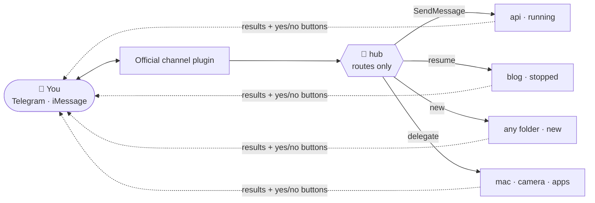

<div align="center">

<a href="https://saswatsam786.github.io/telepilot/">
<picture>
  <source media="(prefers-color-scheme: dark)" srcset="assets/banner-dark.svg">
  <source media="(prefers-color-scheme: light)" srcset="assets/banner-light.svg">
  
</picture>
</a>

# Your Claude Code, in your pocket.

**Text any Claude Code session from Telegram or iMessage.<br>It does the work on your Mac and texts you back.**

[](https://saswatsam786.github.io/telepilot/)
[](#-quick-start)
[](#-how-it-works)
[](#-how-it-works)
[](#-requirements)
[](https://bun.sh)
[](LICENSE)
[](https://github.com/saswatsam786/telepilot/stargazers)

[**Quick start**](#-quick-start) · [**Features**](#-features) · [**How it works**](#-how-it-works) · [**Commands**](#-commands) · [**Security**](#-security) · [**Live demo ↗**](https://saswatsam786.github.io/telepilot/)

</div>

<br>

<table>
<tr>
<td width="55%" valign="middle">

### You left a refactor running. You're on the train.

Did the tests pass? Is it stuck waiting on a permission prompt?

**telepilot turns your chat app into a remote control for every Claude Code session on your Mac.**

- 💬 &nbsp;Message any session by name, or start a new one in any repo
- ✅ &nbsp;Approve risky actions with **one tap**
- 📸 &nbsp;Grab a screenshot or camera photo, open apps, **unlock the Mac**
- 🎙 &nbsp;Send voice notes; they're transcribed on your Mac

It's not another agent. **It's _your_ Claude Code**, with your plan, sessions, skills, MCP servers and permissions. The chat app is just the pipe.

</td>
<td width="45%" align="center" valign="middle">

<picture>
  <source media="(prefers-color-scheme: dark)" srcset="assets/demo-chat.svg">
  <source media="(prefers-color-scheme: light)" srcset="assets/demo-chat-light.svg">
  
</picture>

</td>
</tr>
</table>

## ⚡ Quick start

Paste these three commands into Claude Code:

```bash
/plugin marketplace add saswatsam786/telepilot
/plugin install telepilot@telepilot
/telepilot:setup
```

Setup asks one question (Telegram or iMessage) and does the rest: it installs Bun and tmux if needed, connects your bot, pairs your account and starts the hub. **It takes about 2 minutes.**

> [!TIP]
> Run `telepilot service install` to keep it always on. It starts at login and restarts itself if anything dies.

## ✨ Features

<table>
<tr>
<td colspan="2" valign="top">

### 🧭 &nbsp;Talk to any session
`@api fix the build` goes to a running session. If that session is stopped, it's resumed, and `/new blog ~/code/blog` starts one in any folder. Don't name a session and the hub picks the right one, or asks you.

</td>
<td valign="top">

### ✅ &nbsp;One-tap approvals
Permission prompts arrive as **yes / no buttons**. Claude Code's safety system stays on.

</td>
</tr>
<tr>
<td valign="top">

### 📬 &nbsp;Results come to you
Every session posts its own answer, with live typing and "still working" pings.

</td>
<td colspan="2" valign="top">

### 💻 &nbsp;Your Mac, remotely
Take screenshots and camera photos, open apps, run Shortcuts, read the clipboard, set the volume, check the battery, and use `/unlock` and `/lock`. Your password stays in the Keychain and never goes through chat.

</td>
</tr>
<tr>
<td valign="top">

### 🎙 &nbsp;Voice notes
Voice notes are transcribed locally with whisper.cpp. No cloud.

</td>
<td valign="top">

### 🛡 &nbsp;Safe by default
You get an allowlist, guard hooks, single-use codes, `/panic` and `/audit`.

</td>
<td valign="top">

### 🪶 &nbsp;Zero servers
Everything runs on first-party Claude Code features and nothing else.

</td>
</tr>
</table>

## 🧠 How it works



1. **The hub only routes.** It runs Anthropic's official Telegram channel plus telepilot's dispatcher. It never does heavy work, so it always answers quickly.
2. **Workers are ordinary Claude Code sessions.** Their hooks post results and approval buttons straight to your chat, so no hub tokens are spent relaying.
3. **No server, no cloud.** It's built on background sessions, cross-session messaging and hooks.

<details>
<summary><b>Why not just use the official Telegram plugin?</b></summary>

<br>

The official channel connects Telegram to **one** session. telepilot adds:

- routing to many named, new and stopped sessions
- approvals relayed from background sessions
- Mac tools, unlock and lock
- an always-on supervisor
- guard rails for phone-driven turns

</details>

## 📟 Commands

| Send | What happens |
|:--|:--|
| `@name <task>` | Send to that session |
| `<anything>` | Send to the active session ★, or let the hub decide |
| `/new <name> [folder] [task]` | Start a background session |
| `/sessions` | List sessions, with tap-to-switch buttons |
| `/switch` · `/logs` · `/stop <name>` | Manage sessions |
| `/screenshot` · `/photo` | Screenshot or camera photo of the Mac |
| `/unlock` · `/lock` | Unlock (after you tap yes) or lock the Mac |
| `/panic` | Stop every session telepilot started and deny pending requests |
| `/audit` | Recent remote actions |
| 🎙 voice note | Transcribed locally, then routed |

<details>
<summary><b>🖥 Launcher commands (on the Mac)</b></summary>

<br>

```bash
telepilot start | stop | restart | status | logs | attach | doctor
telepilot stop --all        # kill switch: hub + every session telepilot started
telepilot permissions       # trigger the macOS permission pop-ups once
telepilot unlock-setup      # store your login password in the Keychain for /unlock
telepilot allow-tools       # let sessions use telepilot's Mac tools without prompts
telepilot service install   # LaunchAgent: start at login, self-heal
```

</details>

<details id="-requirements">
<summary><b>📋 Requirements</b></summary>

<br>

- macOS with the Claude Code CLI 2.1.288 or newer, logged in with claude.ai (Pro/Max) or an API key. On Team and Enterprise plans, an admin must enable Channels.
- [Bun](https://bun.sh) and tmux. Setup installs them if they're missing.
- Optional, for voice notes: `brew install ffmpeg whisper-cpp` plus a whisper model.

</details>

## 🔐 Security

> [!IMPORTANT]
> Whoever controls your Telegram account can drive your Mac. **Turn on Telegram two-step verification.**

- **Only you get in.** The official pairing allowlist means only your account reaches the hub.
- **Permissions stay on.** Risky actions need your tap. Codes are random, single-use and expiring, and 3 wrong codes lock approvals for 10 minutes.
- **Guard hooks** block `sudo`, deleting `/` or `~`, disk erasing, `curl | sh`, and reading secrets or the bot token. They also block edits to Claude settings.
- **Trusted routing only.** Workers trust routing headers only from the real hub process, checked by name and PID.
- **Know the channel.** Telegram bot chats aren't end-to-end encrypted. iMessage chats are.

<details>
<summary><b>⚠️ Limitations</b></summary>

<br>

- Channels are a Claude Code research preview.
- A message can't interrupt a session mid-task. It's queued until the current turn ends.
- Terminal-only dialogs, such as workspace trust and MCP logins, need you at the Mac once.

</details>

## 🛠 Development

```bash
bun install && bun test     # unit + integration tests, no network, fake claude
```

The plugin lives in [`plugins/telepilot`](plugins/telepilot) and has no runtime dependencies. The landing page is [`docs/index.html`](docs/index.html). See the plugin's [README](plugins/telepilot/README.md) for the fakechat dev loop.

## 🙏 Credits

Photos on the [landing page](https://saswatsam786.github.io/telepilot/) are from [Unsplash](https://unsplash.com), free to use under the [Unsplash License](https://unsplash.com/license):

- Desk with MacBook Pro by [Iewek Gnos](https://unsplash.com/photos/hhUx08PuYpc)
- Commuters on a train by [John Lockwood](https://unsplash.com/photos/y2pvFL57Qnk)
- Phone against the sky by [Daniel J. Schwarz](https://unsplash.com/photos/PAzD4ArCkuw)

Smooth scrolling by [Lenis](https://github.com/darkroomengineering/lenis) (MIT).

<div align="center">
<br>

### If telepilot saved you a walk back to your desk, drop a ⭐

<sub>MIT © <a href="https://github.com/saswatsam786">saswatsam786</a> · not affiliated with Anthropic or Telegram</sub>

</div>
